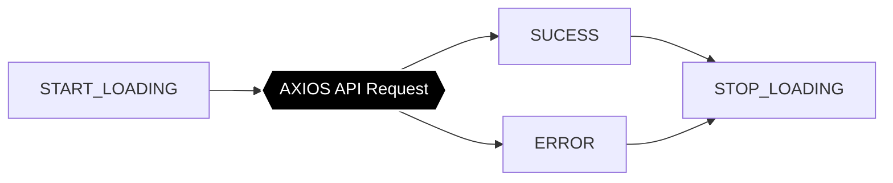

# [Deprecated] [api-request-biolerplate-actions](https://www.npmjs.com/package/api-request-biolerplate-actions/access) (Please, do not use this package. It's not maintained anymore. Now You can use [RTK Query](https://redux-toolkit.js.org/rtk-query/overview) instead)

- If you prefer videos, watch this [video](https://youtu.be/NdoTa-rM9o4) [Arabic speaking].

## Problem statemenxt
- For the most of api requests you make in your React/React-Native app, you need to dispatch boilerplate redux actions such as:

  - **START_LOADING**: before sending the request to show any loading feedback for the user.
  - **STOP_LOADING**: after the request has been succeeded or failed to hide loading feedback.
  - **SUCCESS**: if the request has been succeeded to handle the response and update app state.
  - **ERROR**: if the request has been failed to handle the error and may be show an error message in the relevent screen.



- These actions are necessary to keep the user aware of what is going on. However, this makes api requests have boilerplate code that you should duplicate each time. This package uses **axios interceptors** to dispatch such boilerplate actions for you and also handle them in their relevant reducer letting you care about success case only. It also gives you the ability to decide what actions to dispatch for which requests. So for example, you might have a request that you do not care if it fails, then you have a way to force the package to not dispatch **SET_ERROR** for such request.

## Installation

```
npm i api-request-biolerplate-actions
```

## Usage

- For each api request, you define only one ActionType:

```js
export const GET_DATA = "GET_DATA";
```

- To define an api request action creator:

```js
export const getData = value => (dispatch, getState) => {
  axios.get("some-end-point?param=" + value);
};
```

This is how a basic api request action creator should look like.

- To get these boilerplate actions handled for you in a given reducer, wrap your reducer with `highOrderReducer`:

```js
import {highOrderReducer} from 'api-request-boilerplate-actions';
// import GET_DATA

// define myReducer to handle getData success response which is an action with this type 'SUCCESS_' + GET_DATA
const myReducer = (state, {type, payload}) => {
  switch(type) {
    case 'SUCCESS_' + GET_DATA:
      return {...state, data: payload.data.data};
    default:
      return state;
  }
};

const outOfTheBoxReducer = highOrderReducer(
  {data: []}
  myReducer,
  [{
    requestEndPoint: 'some-end-point',
    baseActionType: GET_DATA
  }]
);

// use outOfTheBoxReducer instead of myReducer
```

now you get these attributes handled for you in outOfTheBoxReducer whenever you make getData request:

- GET_DATA + 'Loading'
- GET_DATA + 'Error'

You can define selectors to access those properties:
```js
// import GET_DATA

export const getDataLoading = (state) => state.[your-reducer-name].[GET_DATA + 'Loading']
export const getDataError = (state) => state.[your-reducer-name].[GET_DATA + 'Error']
```

## Configuration once

- The package should be configured through `config` method.

```js
import { config } from "api-request-boilerplate-actions";
// import store

config(store.dispatch, "https://example.come/api/", errorMessage =>
  alert("error: " + errorMessage)
);
```

## API

- `config`
  a function that should be called once during app start up. It accepts:

  - `dispatch` a reference to dispatch function of redux store.
  - `BASE_URL` your backend base url.
  - `errorHandler` an optional default method to handle your errors which will be called for api requests that have `errorMessage` attribute set in their config object.

- `highOrderReducer`
  a function that should wrap each reducer handling api requests. This function returns another reducer that handles boilerplate actions for you. It accepts:

  - `initialState` which is the initial state of the reducer.
  - `reducer` where you handle only the SET_SUCCESS action.
  - `ApiRequestsConfigObjects` an array of configuration object for each api request. The configuration object should be of this shape:

```js
  {
    requestEndPoint: string | RegExp,
    requestMethod?: AxiosRequestMethod,
    baseActionType: string,
    errorMessage?: string,
    noStart?: boolean,
    noStop?: boolean,
    noSuccess?: boolean,
    noError?: boolean
  }
```

Note that only 2 attributes are mandatory: `requestEndPoint` which is the endpoint this action targets and `baseActionType` which is the action type this endpoint should be mapped to. The rest of attributes are optional. The attributes `noStart`, `noStop`, and `noError` can be set to true whenever you do not want the package to dispatch an action neither handle that action in the reducer for a given request. `noSuccess` can be set to true whenever you do not want the package to dispatch success action for a given request.

## Example

you find an example app under example dir in the repository.

## Test

The package is tested using [Jest](https://jestjs.io/) test runner.

## License

MIT

## Package internal design & Technical implementation
### Package Main Players
 
#### Package Config Manager
responsible for:
  - exposing `config` method that accepts global package configuration from the user
  - binding the `Axios Interceptors` to the axios instance

#### API Request To Config Object Mapper 
responsible for
  - mapping an Axios request object to one of the API requests configs from the user if any
 
#### Derived Action Types Manager
responsible for:
  - deriving actions to be handled by the `High Order Reducer` based on API request config

#### Axios Interceptors
responsible for:
  - Dispatching appropriate actions for an API request
 
#### High Order Reducer
responsible for:
  - Handling actions dispatched by the `Axios Interceptors`

### The package resonsibility can be divided into 2 categories
#### Dispatching redux actions using Axios `Interceptors`


The `Axios Interceptors` receive the request config from axios, let `API Request To Config Object Mapper` maps it into a config object, then based on the config object it dispatches required redux actions using the dispatch instance got from the `Package Config Manager`.

#### Handling redux actions within the `High Order Reducer`


The `High Order Reducer` gets the config objects from the user as a parameter, passes it to the `Derived Action Types Manager` to get the actions that should be handled by the reducer and then handles it.

